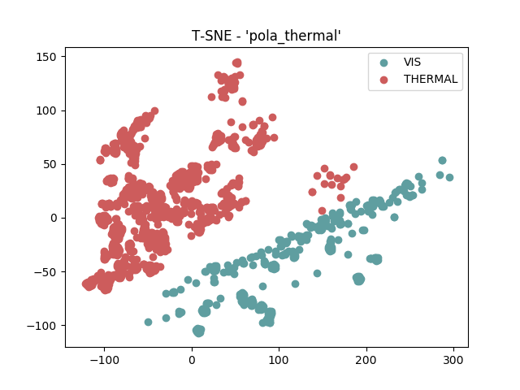
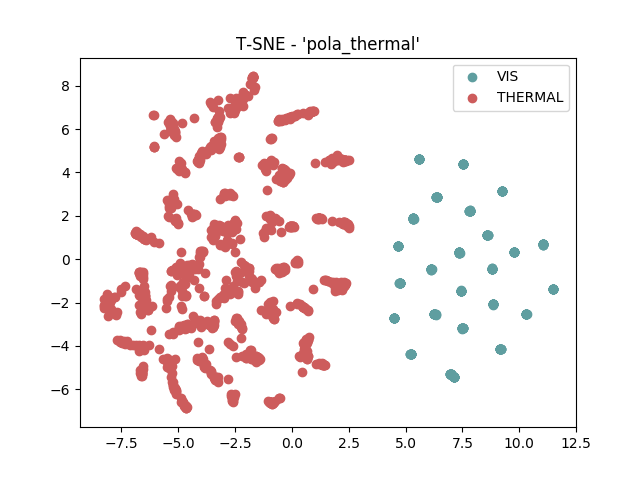
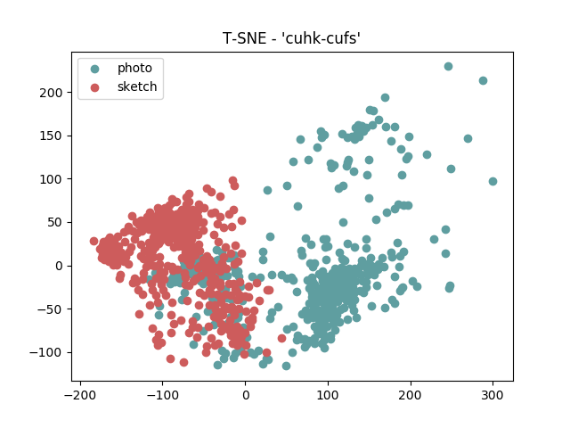
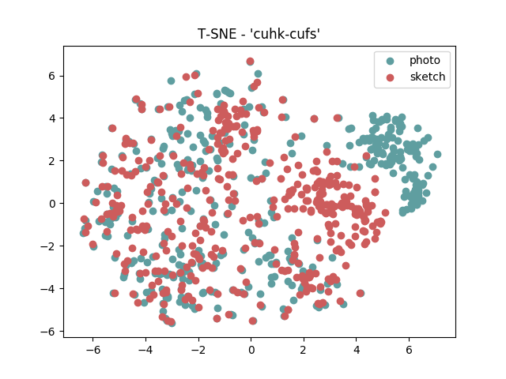
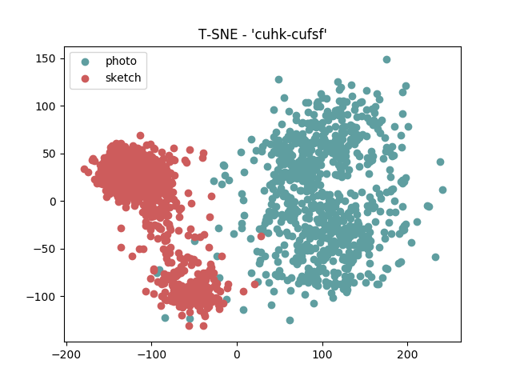
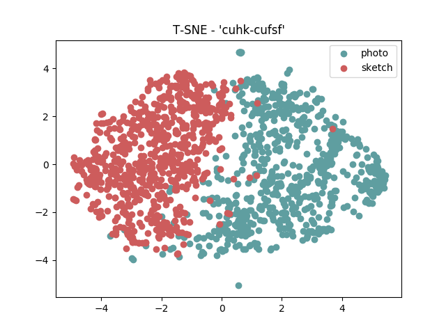
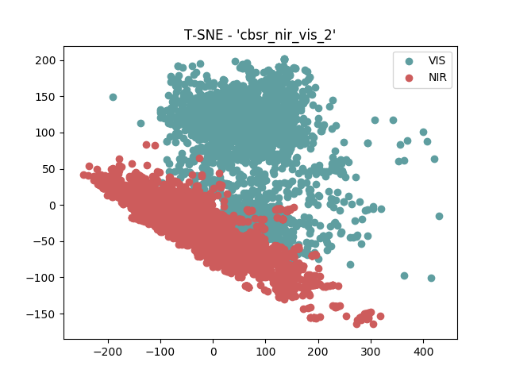
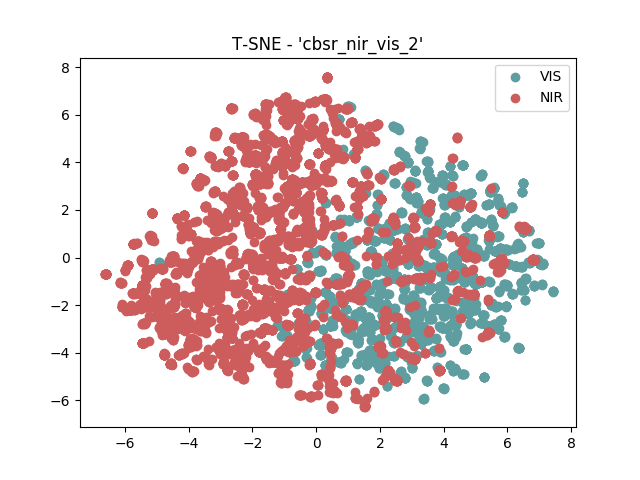

.. vim: set fileencoding=utf-8 :
.. Tiago de Freitas Pereira <tiago.pereira@idiap.ch>

=====================
 Transfer Learning
=====================

In this section we hipothesize that a shared latent subspace exists between two image modalities where the agreement is maximized.
Given a set of covariates of two modalities :math:`X_A` and :math:`X_B`, the goal is to find a common subspace :math:`\phi` where an arbitrary distance function :math:`d` can be applied 
It is expected that the distance is minimal when :math:`X_A` and :math:`X_B` belongs to the same client and maximal otherwise.

In order to train a decent :math:`\phi` let's first visualize the distribution of the covariates :math:`X_A` and :math:`X_B` for different image modalities in two different conditions.
To support this analysis we use the a well know algorithm that supports the visualization of high dimentional data called t-SNE.
This algorithm converts similarities between data points to joint probabilities and tries to minimize the Kullback-Leibler divergence between the joint probabilities of the low-dimensional embedding and the high-dimensional data REF.
This analysis is carried under two different conditions.
The first condition is a t-SNE plot in the pixel space.
The second condition the subspace :math:`\phi` was trained with one of the state of the art CNN using visible light images only; the question here is 
can a highly accurate CNN perform as good in this multimodality scenario?

The CNN :math:`\phi` chosen here is the Inception-ResNet-v2 [Szegedy2017]_.
Such network was trained using gray scale images from the CASIA WebFace database.
Each face was detect and cropped to :math:`160 \times 160` using the MTCCN face detector [Zhang2016]_.
Follow bellow the configuration file to trigger this training.

Such set of tests were conducted under several datasets and they are bellow.

POLA THERMAL
============

Follow below the covariate scatter plot produced with t-SNE, between visible light (:math:`X_A`) and polarimetric thermograms (:math:`X_B`) in the pixel space.
Such scatter plot is split according to the image modalities.

It's possible to clear observe a two clusters formed by the image modalities.
Let's observe now the same scatter plot of :math:`\phi(X_A)` and :math:`\phi(X_B)`

It's possible to clearly observe the same trend as before.

Follow bellow the source code that generate this plot.

+------------+--------------+-------+-------------+
| Image size | ML           | Feat. | Rank-1      |
+============+==============+=======+=============+
| 80 x 64    | ISV (1024g)  | DCT   | 09.88(1.59) |
+------------+--------------+-------+-------------+
| 224 x 224  | Cosine       | VGG16 | 12.00(1.55) |
+------------+--------------+-------+-------------+
| 224 x 224  | GFK          | VGG16 | --.--(-.--) |
+------------+--------------+-------+-------------+
| 224 x 224  | GFK          | Gabor | 54.17(4.61) |
+------------+--------------+-------+-------------+
| 160 x 160  | Cosine       | resnet| 12.86(1.31) |
+------------+--------------+-------+-------------+

CUHK-CUFS
=========

Follow below the covariate scatter plot produced with t-SNE, between visible light (:math:`X_A`) and polarimetric thermograms (:math:`X_B`) in the pixel space.
Such scatter plot is split according to the image modalities.

It's possible to clear observe a two clusters formed by the image modalities.
Let's observe now the same scatter plot of :math:`\phi(X_A)` and :math:`\phi(X_B)`

+------------+--------------+-------+-------------+
| Image size | ML           | Feat. | Rank-1      |
+============+==============+=======+=============+
| 80 x 64    | ISV (512g)   | DCT   | 94.95(1.57) |
+------------+--------------+-------+-------------+
| 224 x 224  | Cosine       | VGG16 | 70.49(1.99) |
+------------+--------------+-------+-------------+
| 224 x 224  | PLDA         | VGG16 | --.--(-.--) |
+------------+--------------+-------+-------------+
| 128 x 128  | GFK          | Gabor | --.--(-.--) |
+------------+--------------+-------+-------------+
| 160 x 160  | Cosine       | Resnet| 54.35(1.86) |
+------------+--------------+-------+-------------+
| 160 x 160  | PLDA         | Resnet| 71.78(1.10) |
+------------+--------------+-------+-------------+

CUHK-CUFSF
==========

Follow below the covariate scatter plot produced with t-SNE, between visible light (:math:`X_A`) and polarimetric thermograms (:math:`X_B`) in the pixel space.
Such scatter plot is split according to the image modalities.

It's possible to clear observe a two clusters formed by the image modalities.
Let's observe now the same scatter plot of :math:`\phi(X_A)` and :math:`\phi(X_B)`

It's possible to clearly observe the same trend as before.

Follow bellow the source code that generate this plot.

CASIA VIS-NIR
=============

Follow below the covariate scatter plot produced with t-SNE, between visible light (:math:`X_A`) and polarimetric thermograms (:math:`X_B`) in the pixel space.
Such scatter plot is split according to the image modalities.

It's possible to clear observe a two clusters formed by the image modalities.
Let's observe now the same scatter plot of :math:`\phi(X_A)` and :math:`\phi(X_B)`

It's possible to clearly observe the same trend as before.

Follow bellow the source code that generate this plot.

+------------+--------------+-------+-------------+
| Image size | ML           | Feat. | Rank-1      |
+============+==============+=======+=============+
| 80 x 64    | ISV (1024g)  | DCT   | 72.38(1.35) |
+------------+--------------+-------+-------------+
| 224 x 224  | Cosine       | VGG16 | 67.73(1.55) |
+------------+--------------+-------+-------------+
| 224 x 224  | PLDA         | VGG16 | --.--(-.--) |
+------------+--------------+-------+-------------+
| 224 x 224  | GFK          | Gabor | 50.93(1.39) |
+------------+--------------+-------+-------------+
| 160 x 160  | Cosine       | resnet| 34.86(1.18) |
+------------+--------------+-------+-------------+
| 160 x 160  | PLDA         | resnet| 34.86(1.18) |
+------------+--------------+-------+-------------+

Siamese Networks
----------------

