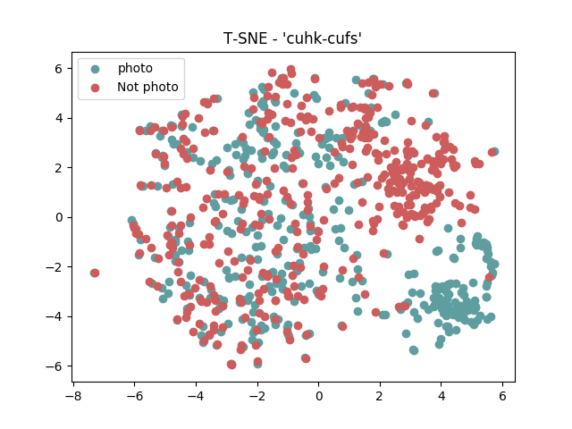

.. vim: set fileencoding=utf-8 :
.. Tiago de Freitas Pereira <tiago.pereira@idiap.ch>

.. _bob.bio.htface:

=====================
 Transfer Learning
=====================

Experiments with RESNETS.

Resnet Initial checkpoint
-------------------------

CUHK-CUFS
=========

TSNE with the 128f embedding

+------------+--------------+-------+-------------+
| Image size | ML           | Feat. | Rank-1      |
+============+==============+=======+=============+
| 80 x 64    | ISV (512g)   | DCT   | 94.95(1.57) |
+------------+--------------+-------+-------------+
| 224 x 224  | Cosine       | VGG16 | 70.49(1.99) |
+------------+--------------+-------+-------------+
| 224 x 224  | PLDA         | VGG16 | --.--(-.--) |
+------------+--------------+-------+-------------+
| 128 x 128  | GFK          | Gabor | --.--(-.--) |
+------------+--------------+-------+-------------+
| 160 x 160  | Cosine       | Resnet| 54.35(1.86) |
+------------+--------------+-------+-------------+
| 160 x 160  | PLDA         | Resnet| 71.78(1.10) |
+------------+--------------+-------+-------------+

CASIA VIS-NIR
=============

+------------+--------------+-------+-------------+
| Image size | ML           | Feat. | Rank-1      |
+============+==============+=======+=============+
| 80 x 64    | ISV (1024g)  | DCT   | 72.38(1.35) |
+------------+--------------+-------+-------------+
| 224 x 224  | Cosine       | VGG16 | 67.73(1.55) |
+------------+--------------+-------+-------------+
| 224 x 224  | PLDA         | VGG16 | --.--(-.--) |
+------------+--------------+-------+-------------+
| 224 x 224  | GFK          | Gabor | 50.93(1.39) |
+------------+--------------+-------+-------------+
| 160 x 160  | Cosine       | resnet| 34.86(1.18) |
+------------+--------------+-------+-------------+
| 160 x 160  | PLDA         | resnet| 34.86(1.18) |
+------------+--------------+-------+-------------+

POLA THERMAL
============

+------------+--------------+-------+-------------+
| Image size | ML           | Feat. | Rank-1      |
+============+==============+=======+=============+
| 80 x 64    | ISV (1024g)  | DCT   | 09.88(1.59) |
+------------+--------------+-------+-------------+
| 224 x 224  | Cosine       | VGG16 | 12.00(1.55) |
+------------+--------------+-------+-------------+
| 224 x 224  | GFK          | VGG16 | --.--(-.--) |
+------------+--------------+-------+-------------+
| 224 x 224  | GFK          | Gabor | 54.17(4.61) |
+------------+--------------+-------+-------------+
| 160 x 160  | Cosine       | resnet| 12.86(1.31) |
+------------+--------------+-------+-------------+

Siamese Networks
----------------

