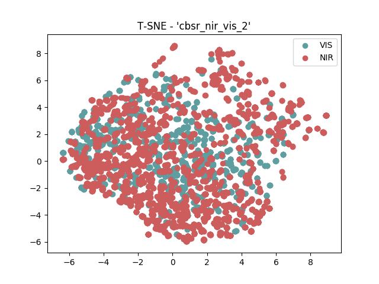

.. vim: set fileencoding=utf-8 :
.. Tiago de Freitas Pereira <tiago.pereira@idiap.ch>

=====================
 Transfer Learning
=====================

In this section we hypothesize that a shared latent subspace exists between two image modalities where the agreement is maximized.
Given a set of covariates of two modalities :math:`X_A` and :math:`X_B`, the goal is to find a common subspace :math:`\phi` where an arbitrary distance function :math:`d` can be applied 
It is expected that the distance is minimal when :math:`X_A` and :math:`X_B` belongs to the same client and maximal otherwise.

First insights
--------------

Before jumping in ways to find this :math:`\phi` let's first do two different analysis.
The **first analysis** is exploratory and it consists on the observation of the distribution of the covariates :math:`X_A` and :math:`X_B` for different image modalities.
To support this analysis we use the a well know algorithm that supports the visualization of high dimentional data called `t-SNE <http://scikit-learn.org/stable/modules/generated/sklearn.manifold.TSNE.html>`_.
This algorithm converts similarities between data points to joint probabilities and tries to minimize the Kullback-Leibler divergence between the joint probabilities of the low-dimensional embedding and the high-dimensional data.
Such exploratory analisys is carried out under two conditions.
The first condition is a direct transformation using the pixel space.
The second condition the subspace :math:`\phi` was trained with one of the state of the art Inception-ResNet-v2 [Szegedy2017]_ (**LINK TO MY TRAINED RESNET**) using gray scaled visible light images only.
Here we try to observe if the modalities cluster.

The **second analisys** is more practical and it consists in the analisys of error rates.
The base question here at this point is to know if state-of-the-art face recognition systems can natually handle the Heterogeneous Face Recognition Problem.

Such set of tests were conducted under several datasets and they are bellow.

  - `POLA THERMAL`_
  - `CUHK-CUFS`_
  - `CUHK-CUFSF`_
  - `CASIA VIS-NIR`_
  - Pericrossed
  - NIVL
  - ...

POLA THERMAL
============

Follow below the covariate scatter plot produced with t-SNE, between visible light (:math:`X_A`) and polarimetric thermograms (:math:`X_B`) in the pixel space for the :ref:`pola thermal <db-polathermal>` database.
Such scatter plot is split according to the image modalities.

.. image:: ./plots/transfer-learning/pola_thermal/tsne/pixel_space.png

It's possible to clearly observe a two clusters formed by the image modalities.
Let's observe now the same scatter plot of :math:`\phi(X_A)` and :math:`\phi(X_B)`

.. image:: ./plots/transfer-learning/pola_thermal/tsne/resnet_gray_face_space.png

It's possible to clearly observe the same trend as before.
Follow bellow the source code that generate this plot::

  $ ./doc/plots/transfer-learning/pola_thermal/tsne/plot_tsne_resnet_gray.sh

Follow bellow the results in terms of Rank-1 recognition rate

 +------------+--------------+--------+-------------------+
 | Image size | ML           | Feat.  | Rank-1            |
 +============+==============+========+===================+
 | 160 x 160  | PCA          | pixels | to be done        |
 +------------+--------------+--------+-------------------+
 | 160 x 160  | Resnet-Gray  |        | 11.798% (1.556)   |
 +------------+--------------+--------+-------------------+

By observing these lower error rates along the splits, we can conclude that
using a :math:`\phi` that doesn't take into account the modality prior is not very promissing.

.. +------------+--------------+-------+-------------+
.. | Image size | ML           | Feat. | Rank-1      |
.. +============+==============+=======+=============+
.. | 80 x 64    | ISV (1024g)  | DCT   | 09.88(1.59) |
.. +------------+--------------+-------+-------------+
.. | 224 x 224  | Cosine       | VGG16 | 12.00(1.55) |
.. +------------+--------------+-------+-------------+
.. | 224 x 224  | GFK          | VGG16 | --.--(-.--) |
.. +------------+--------------+-------+-------------+
.. | 224 x 224  | GFK          | Gabor | 54.17(4.61) |
.. +------------+--------------+-------+-------------+
.. | 160 x 160  | Cosine       | resnet| 12.86(1.31) |
.. +------------+--------------+-------+-------------+

CUHK-CUFS
=========

Follow below the covariate scatter plot produced with t-SNE, between visible light (:math:`X_A`) and viewd sketches (:math:`X_B`) in the pixel space for the :ref:`CUHK-CUFS <db-CUHK-CUFS>` database.
Such scatter plot is split according to the image modalities.

.. image:: ./plots/transfer-learning/cuhk_cufs/tsne/pixel_space.png

It's possible to clear observe a two clusters formed by the image modalities.

Let's observe now the same scatter plot of :math:`\phi(X_A)` and :math:`\phi(X_B)`
.. image:: ./plots/transfer-learning/cuhk_cufs/tsne/resnet_gray.png

Such clusters can't be clearly observed for this pair of modalities.

Follow bellow the results in terms of Rank-1 recognition rate

 +------------+--------------+--------+-------------------+
 | Image size | ML           | Feat.  | Rank-1            |
 +============+==============+========+===================+
 | 160 x 160  | PCA          | pixels | to be done        |
 +------------+--------------+--------+-------------------+
 | 160 x 160  | Resnet-Gray  |        | 64.158% (3.424)   |
 +------------+--------------+--------+-------------------+

.. +------------+--------------+-------+-------------+
.. | Image size | ML           | Feat. | Rank-1      |
.. +============+==============+=======+=============+
.. | 80 x 64    | ISV (512g)   | DCT   | 94.95(1.57) |
.. +------------+--------------+-------+-------------+
.. | 224 x 224  | Cosine       | VGG16 | 70.49(1.99) |
.. +------------+--------------+-------+-------------+
.. | 224 x 224  | PLDA         | VGG16 | --.--(-.--) |
.. +------------+--------------+-------+-------------+
.. | 128 x 128  | GFK          | Gabor | --.--(-.--) |
.. +------------+--------------+-------+-------------+
.. | 160 x 160  | Cosine       | Resnet| 54.35(1.86) |
.. +------------+--------------+-------+-------------+
.. | 160 x 160  | PLDA         | Resnet| 71.78(1.10) |
.. +------------+--------------+-------+-------------+

CUHK-CUFSF
==========

Follow below the covariate scatter plot produced with t-SNE, between visible light (:math:`X_A`) and viewd sketches (:math:`X_B`) in the pixel space for the :ref:`CUHK-CUFSF <db-CUHK-CUFSF>` database.
Such scatter plot is split according to the image modalities.

It's possible to clear observe a two clusters formed by the image modalities.

Let's observe now the same scatter plot of :math:`\phi(X_A)` and :math:`\phi(X_B)`
.. image:: ./plots/transfer-learning/cuhk_cufsf/tsne/resnet_gray.png

It's possible to clearly observe the same trend as before.
Follow bellow the source code that generate this plot::

  $ ./doc/plots/transfer-learning/pola_thermal/tsne/plot_tsne_resnet_gray.sh

Follow bellow the results in terms of Rank-1 recognition rate

 +------------+--------------+--------+-------------------+
 | Image size | ML           | Feat.  | Rank-1            |
 +============+==============+========+===================+
 | 160 x 160  | PCA          | pixels | to be done        |
 +------------+--------------+--------+-------------------+
 | 160 x 160  | Resnet-Gray  |        | 16.518%(1.394)    |
 +------------+--------------+--------+-------------------+

CASIA VIS-NIR
=============

Follow below the covariate scatter plot produced with t-SNE, between visible light (:math:`X_A`) and polarimetric thermograms (:math:`X_B`) in the pixel space.
Such scatter plot is split according to the image modalities.

It's possible to clear observe a two clusters formed by the image modalities.
Let's observe now the same scatter plot of :math:`\phi(X_A)` and :math:`\phi(X_B)`

It's possible to clearly observe the same trend as before.

Follow bellow the source code that generate this plot.

.. +------------+--------------+-------+-------------+
.. | Image size | ML           | Feat. | Rank-1      |
.. +============+==============+=======+=============+
.. | 80 x 64    | ISV (1024g)  | DCT   | 72.38(1.35) |
.. +------------+--------------+-------+-------------+
.. | 224 x 224  | Cosine       | VGG16 | 67.73(1.55) |
.. +------------+--------------+-------+-------------+
.. | 224 x 224  | PLDA         | VGG16 | --.--(-.--) |
.. +------------+--------------+-------+-------------+
.. | 224 x 224  | GFK          | Gabor | 50.93(1.39) |
.. +------------+--------------+-------+-------------+
.. | 160 x 160  | Cosine       | resnet| 34.86(1.18) |
.. +------------+--------------+-------+-------------+
.. | 160 x 160  | PLDA         | resnet| 34.86(1.18) |
.. +------------+--------------+-------+-------------+

NIVL
====

Follow below the covariate scatter plot produced with t-SNE, between visible light (:math:`X_A`) and polarimetric thermograms (:math:`X_B`) in the pixel space.
Such scatter plot is split according to the image modalities.

XXX

It's possible to clear observe a two clusters formed by the image modalities.
Let's observe now the same scatter plot of :math:`\phi(X_A)` and :math:`\phi(X_B)`

It's possible to clearly observe the same trend as before.

Follow bellow the source code that generate this plot.

 +------------+--------------+--------+-------------------+
 | Image size | ML           | Feat.  | Rank-1            |
 +============+==============+========+===================+
 | 160 x 160  | PCA          | pixels | to be done        |
 +------------+--------------+--------+-------------------+
 | 160 x 160  | Resnet-Gray  |        | 60.009%(2.518)    |
 +------------+--------------+--------+-------------------+

Siamese Networks
----------------

