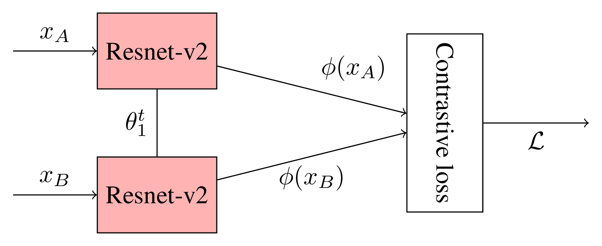
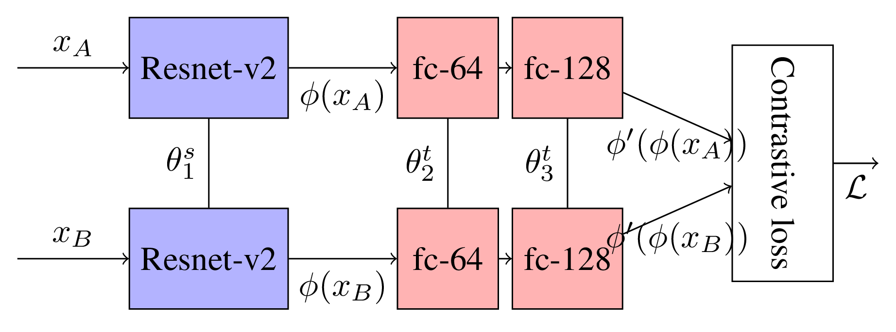

.. vim: set fileencoding=utf-8 :
.. Tiago de Freitas Pereira <tiago.pereira@idiap.ch>

Preamble
--------

From the experiments in :ref:`first insights section <first-insights>` it was possible to observe that a CNN model
trained with only visible images provided recognition rates far from being random, but still with very low
if compared with the state-of-the-art in our closed-set evaluation.

In this section we will explore strategies on how to use such prior and adapt our :math:`\phi` to some target image modality.

.. note:: Some details about this chart and the following ones.

          - :math:`x_A` and :math:`x_B` corresponds to inputs from different image modalities :math:`A` and :math:`B`
          
          - :math:`\theta` corresponds to the latent variables. The superscript :math:`t` (:math:`\theta^t`) means that such
            :math:`\theta` is trainable (boxes filled with red). The superscript :math:`s` (:math:`\theta^s`) means that such 
            :math:`\theta` is **not** trainable (boxes filled in blue).

.. Todo:: Decribe the setup for triplets

One commom wisdom about convolutional neural networks states that feature detectors from the first layers of the network are more
general (edge detectors, color blobs, etc..), and upper layers handle high level entities (such as eyes, nose, etc..).
Some researchers systematically noticed some tendencies in this level, such as, Gabor filters, color blobs, edge detector [Yosinski2014]_.

Our task handles essentially with faces sensed in different image modalities.
Assuming that faces and macro elements of the face, such as, eyes, nose and mouth, are modeled in higher layers of a deep neural network, it's
reasonable to hypothesize that a joint modeling between different image modalities would take place in the first layers.
.. With the input signal going deeper into the architecture, the feature detectors tend to be more task (database) specific.

At this point we have some research questions here.

1. Are our prior :math:`\phi` (trained with visual light images) too modality specific? 
Can we train a modality specific embedding on top of this prior?

If our current feature detectors preserve some information about the image modality, 
will invalidate our base hypothesis and we to approach the taks we could just train a shallow network on top of this prior (or other classifier).

2. If the first question is a negative, it suggests that information about the image modality carried in the
input signal is suppresed by the deep set of feature detectors. The question here is, can we retrain a 
subset of the first layers in order to preserve the modality information?

To approch those two questions we designed two set of experiments.

Siamese Networks
****************

Siamese Neural Networks (**SNN**) [Chopra2005]_ learn the non-linear subspaces :math:`\phi` by repeatedly presenting
pairs of positive and negative examples (belonging to the same class or not).
To our particular task, the pairs of examples belong to clients sensed by different image modalities
(:math:`X_A` and :math:`X_B` ) as we can observe in the figure below.

, where :math:`\mathcal{L}` is defined as :math:`\mathcal{L}(x_A, x_B) = || \phi_{\theta_1}(x_A) - \phi_{\theta_1}(x_B)||`.

Adaptation of our prior embeddings using Siamese networks
+++++++++++++++++++++++++++++++++++++++++++++++++++++++++

In this section we approach our first research question.
Such approach is summarized in the image below.

As can be observed, the input signals from two image modalities (:math:`x_A` and :math:`x_B`) are projected using
our prior :math:`\phi`.
The 128d embedding are feed into a 2-layer neural network (:math:`\phi'`) with 64 neurons with ReLU non activation (:math:`\theta_2`)
followed by another fully connected layer with 128 neurons with linear activation (:math:`\theta_3`).

.. literalinclude:: ../../bob/bio/htface/architectures/Transfer.py
   :language: python
   :pyobject: build_transfer_graph
   :caption: "Transfer.py"

Next subsections we describe recognition rate results in the same fashion as in :ref:`first insights section <first-insights>`.

POLA THERMAL
############

  Follow bellow the results in terms of Rank-1 recognition rate under this assumption using 
  the thermograms database.

 +----------------+------------------+-------------------+
 | Image size     | CNN              | Rank-1            |
 +================+==================+===================+
 | 160 x 160      | Inception V2     | 11.798% (1.556)   |
 +----------------+------------------+-------------------+
 | **160 x 160**  | **128-64-128**   | **6.964% (1.37)** |
 +----------------+--------------------------------------+

It's possible to observe a decrease in the recognition rate using this assumption suggesting that it's
not possible to learn a modality map using the embeddings of our prior :math:`\phi`.
 
The following steps train and evaluate such CNN::

 $ bob_htface_train_cnn.py  --baselines idiap_casia_inception_v2_gray_transfer_64_128 --databases pola_thermal
 $ bob_htface_cnn_baselines.py --baselines idiap_casia_inception_v2_gray_transfer_64_128 --databases pola_thermal

CUHK-CUFS
#########

  Follow bellow the results in terms of Rank-1 recognition rate under this assumption using 
  the viewable sketch database .

 +----------------+------------------+-----------------------+
 | Image size     | CNN              | Rank-1                |
 +================+==================+=======================+
 | 160 x 160      | Inception V2     | 64.158% (3.424)       |
 +----------------+------------------+-----------------------+
 | **160 x 160**  | **128-64-128**   | **22.178% (5.534)**   |
 +----------------+------------------+-----------------------+

It's possible to observe a severe decrease in the recognition rate using this assumption suggesting that it's
not possible to learn a modality map using the embeddings or our prior :math:`\phi`.
 
The following steps train and evaluate such CNN::

 $ bob_htface_train_cnn.py  --baselines idiap_casia_inception_v2_gray_transfer_64_128 --databases cuhk_cufs
 $ bob_htface_cnn_baselines.py --baselines idiap_casia_inception_v2_gray_transfer_64_128 --databases cuhk_cufs

CUHK-CUFSF
##########

  Follow bellow the results in terms of Rank-1 recognition rate under this assumption using 
  the viewable sketch database .

 +----------------+------------------+------------------+
 | Image size     | CNN              | Rank-1           |
 +================+==================+==================+
 | 160 x 160      | Inception V2     | 16.518%(1.394)   |
 +----------------+-------------------------------------+
 | **160 x 160**  | **128-64-128**   | **7.085(0.64)**  |
 +----------------+------------------+------------------+

It's possible to observe a severe decrease in the recognition rate using this assumption suggesting that it's
not possible to learn a modality map using the embeddings or our prior :math:`\phi`.
 
The following steps train and evaluate such CNN::

 $ bob_htface_train_cnn.py  --baselines idiap_casia_inception_v2_gray_transfer_64_128 --databases cuhk_cufsf
 $ bob_htface_cnn_baselines.py --baselines idiap_casia_inception_v2_gray_transfer_64_128 --databases cuhk_cufsf

CASIA NIR-VIS
#############

  Follow bellow the results in terms of Rank-1 recognition rate under this assumption using 
  the NIR baseline.

 +----------------+------------------+------------------+
 | Image size     | CNN              | Rank-1           |
 +================+==================+==================+
 | 160 x 160      | Inception V2     | 44.031%(0.999)   |
 +----------------+------------------+------------------+
 | **160 x 160**  | **128-64-128**   | **30.716(0.8)**  |
 +----------------+------------------+------------------+

It's possible to observe a severe decrease in the recognition rate using this assumption suggesting that it's
not possible to learn a modality map using the embeddings or our prior :math:`\phi`.
 
The following steps train and evaluate such CNN::

 $ bob_htface_train_cnn.py  --baselines idiap_casia_inception_v2_gray_transfer_64_128 --databases casia_nir_vis
 $ bob_htface_cnn_baselines.py --baselines idiap_casia_inception_v2_gray_transfer_64_128 --databases casia_nir_vis

NIVL
####

  Follow bellow the results in terms of Rank-1 recognition rate under this assumption using 
  the NIR baseline.

 +----------------+------------------+-------------------+
 | Image size     | CNN              | Rank-1            |
 +================+==================+===================+
 | 160 x 160      | Inception V2     | 60.009% (2.518)   |
 +----------------+------------------+-------------------+
 | **160 x 160**  | **128-64-128**   | **31.772 (1.061)**|
 +----------------+------------------+-------------------+

It's possible to observe a severe decrease in the recognition rate using this assumption suggesting that it's
not possible to learn a modality map using the embeddings or our prior :math:`\phi`.
 
The following steps train and evaluate such CNN::

 $ bob_htface_train_cnn.py  --baselines idiap_casia_inception_v2_gray_transfer_64_128 --databases cuhk_cufsf
 $ bob_htface_cnn_baselines.py --baselines idiap_casia_inception_v2_gray_transfer_64_128 --databases cuhk_cufsf

Final Discussions
#################

In this sections we tried to answer the question if it is possible to model modality specific embeddings on top of 
our prior :math:`\phi`.
The results, in terms of recognition rate, were very conclusive showing that :math:`\phi` degrades the modality input signal
in such a way that is not possible to do a modality map on top of the embedding.

.. Todo:: Can we visually inspect that??

.. Todo:: Shall I try different classifiers on top of it?

Adaptation of the first layers of our prior using Siamese networks
++++++++++++++++++++++++++++++++++++++++++++++++++++++++++++++++++

In this section we approach our second research question.

Just to wrap up, in this section we hyphotesize that we can joint model two image modalities by backpropagating only in
the :math:`n` first layers of :math:`\phi`.

As decribed before, our :math:`\phi` is defined by the Resnet V2 [Szegedy2017]_.

.. Todo:: LINK THE ARCHITECTURE

Such adaptation will take place in 6 different points of the CNN (the rest of the network is kept intact):
 - Adapt first layer of :math:`\phi`: error backpropagated only in **Conv2d_1a_3x3**
 - Adapt layers 1-2 of :math:`\phi`: error backpropagated in **Conv2d_1a_3x3**, **Conv2d_2a_3x3** and **"Conv2d_2b_3x3"**
 - Adapt layers 1-4 of :math:`\phi`: error backpropagated in **Conv2d_1a_3x3**, **Conv2d_2a_3x3**, **"Conv2d_2b_3x3"**,  **Conv2d_3b_1x1** and **Conv2d_4a_3x3**
 - Adapt layers 1-5 of :math:`\phi`: error backpropagated in **Conv2d_1a_3x3**, **Conv2d_2a_3x3**, **"Conv2d_2b_3x3"**, **Conv2d_3b_1x1**, **Conv2d_4a_3x3** and **Mixed_5b** 
 - Adapt layers 1-6 of :math:`\phi`: error backpropagated in **Conv2d_1a_3x3**, **Conv2d_2a_3x3**, **"Conv2d_2b_3x3"**, **Conv2d_3b_1x1**, **Conv2d_4a_3x3** and **Block35**
 - Adapt the whole :math:`\phi`

POLA THERMAL
############

Follow bellow the results in terms of Rank-1 recognition rate under this assumption using 
the thermograms database.

 +----------------+------------------+-------------------+
 | Image size     | CNN              | Rank-1            |
 +================+==================+===================+
 | 160 x 160      | Inception V2     | 11.798% (1.556)   |
 +----------------+------------------+-------------------+
 | **160 x 160**  | **Adapt first**  | **13.952(2.104)** |
 +----------------+-------------------+------------------+
 | **160 x 160**  | **Adapt 1-2**    | **22.964(4.181)** |
 +----------------+------------------+-------------------+
 | **160 x 160**  | **Adapt 1-4**    | **27.917(2.825)** |
 +----------------+------------------+-------------------+
 | **160 x 160**  | **Adapt 1-5**    | **29.381(4.002)** |
 +----------------+------------------+-------------------+
 | **160 x 160**  | **Adapt 1-6**    | **32.583(3.409)** |
 +----------------+------------------+-------------------+
 | **160 x 160**  | **Adapt All**    | **8.917(1.409)**  |
 +----------------+------------------+-------------------+

It's possible to observe that the recognition rate increases according with the amount of layers we adapt which corroborates with our assumptions.
However, such error rate drops drastically when the whole network is adapted.
This is understandable, since the amount of parameters to be learnt are several times bigger than the amount of data available to train this task.

The sequence of commands below run the amount of experiments necessary to run this plot::

  $ # Adapting first layer
  $ bob_htface_train_cnn.py --baselines idiap_casia_inception_v2_gray_adapt_first_layer --databases pola_thermal
  $ bob_htface_baselines.py --baselines idiap_casia_inception_v2_gray_adapt_first_layer --databases pola_thermal
  
  $ # Adapting layers 1-2  
  $ bob_htface_train_cnn.py --baselines idiap_casia_inception_v2_gray_adapt_layers_1_2 --databases pola_thermal  
  $ bob_htface_baselines.py --baselines idiap_casia_inception_v2_gray_adapt_layers_1_2 --databases pola_thermal  
     
  $ # Adapting layers 1-4
  $ bob_htface_train_cnn.py --baselines idiap_casia_inception_v2_gray_adapt_layers_1_4 --databases pola_thermal  
  $ bob_htface_baselines.py --baselines idiap_casia_inception_v2_gray_adapt_layers_1_4 --databases pola_thermal  

  $ # Adapting layers 1-5
  $ bob_htface_train_cnn.py --baselines idiap_casia_inception_v2_gray_adapt_layers_1_5 --databases pola_thermal  
  $ bob_htface_baselines.py --baselines idiap_casia_inception_v2_gray_adapt_layers_1_5 --databases pola_thermal  

  $ # Adapting layers 1-6
  $ bob_htface_train_cnn.py --baselines idiap_casia_inception_v2_gray_adapt_layers_1_6 --databases pola_thermal  
  $ bob_htface_baselines.py --baselines idiap_casia_inception_v2_gray_adapt_layers_1_6 --databases pola_thermal  

  $ # Adapting all layers
  $ bob_htface_train_cnn.py --baselines idiap_casia_inception_v2_gray_adapt_all_layers --databases pola_thermal
  $ bob_htface_baselines.py --baselines idiap_casia_inception_v2_gray_adapt_all_layers --databases pola_thermal  

CUHK-CUFS
#########

Follow bellow the results in terms of Rank-1 recognition rate under this assumption using 
the viewed sketch database.

 +----------------+------------------+-------------------+
 | Image size     | CNN              | Rank-1            |
 +================+==================+===================+
 | 160 x 160      | Inception V2     | 64.158% (3.424)   |
 +----------------+------------------+-------------------+
 | **160 x 160**  | **Adapt first**  | **63.366% (   )** |
 +----------------+------------------+-------------------+
 | **160 x 160**  | **Adapt 1-2**    | **64.851% (   )** |
 +----------------+------------------+-------------------+
 | **160 x 160**  | **Adapt 1-4**    | **78.713% (   )** |
 +----------------+------------------+-------------------+
 | **160 x 160**  | **Adapt 1-5**    | **83.168% (   )** |
 +----------------+------------------+-------------------+ 
 | **160 x 160**  | **Adapt 1-6**    | **82.921 (1.422)**|
 +----------------+------------------+-------------------+
 | **160 x 160**  | **Adapt All**    | **23.762% (    )**|
 +----------------+------------------+-------------------+

The same trends as before can be observed.
The recognition rate increases according with the amount of layers we adapt.
Adapting the whole networks leads to a heavy overfitting, making the error rates drop to ~20%.

The sequence of commands below run the amount of experiments necessary to run this plot::

  $ # Adapting first layer
  $ bob_htface_train_cnn.py --baselines idiap_casia_inception_v2_gray_adapt_first_layer --databases cuhk_cufs
  $ bob_htface_baselines.py --baselines idiap_casia_inception_v2_gray_adapt_first_layer --databases cuhk_cufs
  
  $ # Adapting layers 1-2  
  $ bob_htface_train_cnn.py --baselines idiap_casia_inception_v2_gray_adapt_layers_1_2 --databases cuhk_cufs
  $ bob_htface_baselines.py --baselines idiap_casia_inception_v2_gray_adapt_layers_1_2 --databases cuhk_cufs
     
  $ # Adapting layers 1-4
  $ bob_htface_train_cnn.py --baselines idiap_casia_inception_v2_gray_adapt_layers_1_4 --databases cuhk_cufs
  $ bob_htface_baselines.py --baselines idiap_casia_inception_v2_gray_adapt_layers_1_4 --databases cuhk_cufs

  $ # Adapting layers 1-5
  $ bob_htface_train_cnn.py --baselines idiap_casia_inception_v2_gray_adapt_layers_1_5 --databases cuhk_cufs
  $ bob_htface_baselines.py --baselines idiap_casia_inception_v2_gray_adapt_layers_1_5 --databases cuhk_cufs

  $ # Adapting layers 1-6
  $ bob_htface_train_cnn.py --baselines idiap_casia_inception_v2_gray_adapt_layers_1_6 --databases cuhk_cufs
  $ bob_htface_baselines.py --baselines idiap_casia_inception_v2_gray_adapt_layers_1_6 --databases cuhk_cufs

  $ # Adapting all layers
  $ bob_htface_train_cnn.py --baselines idiap_casia_inception_v2_gray_adapt_all_layers --databases cuhk_cufs
  $ bob_htface_baselines.py --baselines idiap_casia_inception_v2_gray_adapt_all_layers --databases cuhk_cufs

CUHK-CUFSF
##########

Follow bellow the results in terms of Rank-1 recognition rate under this assumption using 
the viewed sketch database.

 +----------------+------------------+-------------------+
 | Image size     | CNN              | Rank-1            |
 +================+==================+===================+
 | 160 x 160      | Inception V2     | 16.518%(1.394)    |
 +----------------+------------------+-------------------+
 | **160 x 160**  | **Adapt first**  | **15.182% (   )** |
 +----------------+------------------+-------------------+
 | **160 x 160**  | **Adapt 1-2**    | **18.623% (   )** |
 +----------------+------------------+-------------------+
 | **160 x 160**  | **Adapt 1-4**    | **36.235% (   )** |
 +----------------+------------------+-------------------+
 | **160 x 160**  | **Adapt 1-5**    | **41.093% (    )**|
 +----------------+------------------+-------------------+
 | **160 x 160**  | **Adapt 1-6**    | **--.---% (    )**|
 +----------------+------------------+-------------------+
 | **160 x 160**  | **Adapt All**    | **-    % (    )** |
 +----------------+------------------+-------------------+
 

The same trends as before can be observed.
The recognition rate increases according with the amount of layers we adapt.
Adapting the whole networks leads to a heavy overfitting, making the error rates drop to ~20%.

The sequence of commands below run the amount of experiments necessary to run this plot::

  $ # Adapting first layer
  $ bob_htface_train_cnn.py --baselines idiap_casia_inception_v2_gray_adapt_first_layer --databases cuhk_cufsf
  $ bob_htface_baselines.py --baselines idiap_casia_inception_v2_gray_adapt_first_layer --databases cuhk_cufsf
  
  $ # Adapting layers 1-2  
  $ bob_htface_train_cnn.py --baselines idiap_casia_inception_v2_gray_adapt_layers_1_2 --databases cuhk_cufsf
  $ bob_htface_baselines.py --baselines idiap_casia_inception_v2_gray_adapt_layers_1_2 --databases cuhk_cufsf
     
  $ # Adapting layers 1-4
  $ bob_htface_train_cnn.py --baselines idiap_casia_inception_v2_gray_adapt_layers_1_4 --databases cuhk_cufsf
  $ bob_htface_baselines.py --baselines idiap_casia_inception_v2_gray_adapt_layers_1_4 --databases cuhk_cufsf

  $ # Adapting layers 1-5
  $ bob_htface_train_cnn.py --baselines idiap_casia_inception_v2_gray_adapt_layers_1_5 --databases cuhk_cufsf
  $ bob_htface_baselines.py --baselines idiap_casia_inception_v2_gray_adapt_layers_1_5 --databases cuhk_cufsf

  $ # Adapting layers 1-6
  $ bob_htface_train_cnn.py --baselines idiap_casia_inception_v2_gray_adapt_layers_1_6 --databases cuhk_cufsf
  $ bob_htface_baselines.py --baselines idiap_casia_inception_v2_gray_adapt_layers_1_6 --databases cuhk_cufsf

  $ # Adapting all layers
  $ bob_htface_train_cnn.py --baselines idiap_casia_inception_v2_gray_adapt_all_layers --databases cuhk_cufsf
  $ bob_htface_baselines.py --baselines idiap_casia_inception_v2_gray_adapt_all_layers --databases cuhk_cufsf

CASIA NIR-VIS
#############

Follow bellow the results in terms of Rank-1 recognition rate under this assumption using 
a NIR database.

 +----------------+------------------+-------------------+
 | Image size     | CNN              | Rank-1            |
 +================+==================+===================+
 | 160 x 160      | Inception V2     | 44.031%(1.394)    |
 +----------------+------------------+-------------------+
 | **160 x 160**  | **Adapt first**  | **40.206% (   )** |
 +----------------+------------------+-------------------+
 | **160 x 160**  | **Adapt 1-2**    | **54.832% (   )** |
 +----------------+------------------+-------------------+
 | **160 x 160**  | **Adapt 1-4**    | **77.835% (   )** |
 +----------------+------------------+-------------------+
 | **160 x 160**  | **Adapt 1-5**    | **61.405% (    )**|
 +----------------+------------------+-------------------+
 | **160 x 160**  | **Adapt 1-6**    | **--.---% (    )**|
 +----------------+------------------+-------------------+
 | **160 x 160**  | **Adapt All**    | **-    % (    )** |
 +----------------+------------------+-------------------+

The same trends as before can be observed.
The recognition rate increases according with the amount of layers we adapt, but with on particular difference.
Unlike the other modalites, for this one the error rate starts to decay quite "early".
A drop can be observed when the adaptation takes place from layers 1-5 (**Conv2d_1a_3x3**, **Conv2d_2a_3x3**, **"Conv2d_2b_3x3"**, **Conv2d_3b_1x1**, **Conv2d_4a_3x3** and **Mixed_5b**).
The sequence of commands below run the amount of experiments necessary to run this plot::

  $ # Adapting first layer
  $ bob_htface_train_cnn.py --baselines idiap_casia_inception_v2_gray_adapt_first_layer --databases casia_nir_vis
  $ bob_htface_baselines.py --baselines idiap_casia_inception_v2_gray_adapt_first_layer --databases casia_nir_vis
  
  $ # Adapting layers 1-2  
  $ bob_htface_train_cnn.py --baselines idiap_casia_inception_v2_gray_adapt_layers_1_2 --databases casia_nir_vis
  $ bob_htface_baselines.py --baselines idiap_casia_inception_v2_gray_adapt_layers_1_2 --databases casia_nir_vis
     
  $ # Adapting layers 1-4
  $ bob_htface_train_cnn.py --baselines idiap_casia_inception_v2_gray_adapt_layers_1_4 --databases casia_nir_vis
  $ bob_htface_baselines.py --baselines idiap_casia_inception_v2_gray_adapt_layers_1_4 --databases casia_nir_vis

  $ # Adapting layers 1-5
  $ bob_htface_train_cnn.py --baselines idiap_casia_inception_v2_gray_adapt_layers_1_5 --databases casia_nir_vis
  $ bob_htface_baselines.py --baselines idiap_casia_inception_v2_gray_adapt_layers_1_5 --databases casia_nir_vis

  $ # Adapting layers 1-6
  $ bob_htface_train_cnn.py --baselines idiap_casia_inception_v2_gray_adapt_layers_1_6 --databases casia_nir_vis
  $ bob_htface_baselines.py --baselines idiap_casia_inception_v2_gray_adapt_layers_1_6 --databases casia_nir_vis

  $ # Adapting all layers
  $ bob_htface_train_cnn.py --baselines idiap_casia_inception_v2_gray_adapt_all_layers --databases casia_nir_vis
  $ bob_htface_baselines.py --baselines idiap_casia_inception_v2_gray_adapt_all_layers --databases casia_nir_vis

NIVL
####

Follow bellow the results in terms of Rank-1 recognition rate under this assumption using 
a NIR database.

 86.386 1-4

 +----------------+------------------+-------------------+
 | Image size     | CNN              | Rank-1            |
 +================+==================+===================+
 | 160 x 160      | Inception V2     | 60.009%(2.518)    |
 +----------------+------------------+-------------------+
 | **160 x 160**  | **Adapt first**  | **69.796% (   )** |
 +----------------+------------------+-------------------+
 | **160 x 160**  | **Adapt 1-2**    | **82.74% (    )** |
 +----------------+------------------+-------------------+
 | **160 x 160**  | **Adapt 1-4**    | **85.123% (   )** |
 +----------------+------------------+-------------------+
 | **160 x 160**  | **Adapt 1-5**    | **76.713% (    )**|
 +----------------+------------------+-------------------+
 | **160 x 160**  | **Adapt 1-6**    | **77.964 (     )**|
 +----------------+------------------+-------------------+  
 | **160 x 160**  | **Adapt All**    | **-    % (    )** |
 +----------------+------------------+-------------------+
 

The exact same trend observed in CASIA-NIR-VIS can be observerved for this database. 
The recognition rate increases according with the amount of layers we adapt and starts to decay in the exact same point.

The sequence of commands below run the amount of experiments necessary to run this plot::

  $ # Adapting first layer
  $ bob_htface_train_cnn.py --baselines idiap_casia_inception_v2_gray_adapt_first_layer --databases nivl
  $ bob_htface_baselines.py --baselines idiap_casia_inception_v2_gray_adapt_first_layer --databases nivl
  
  $ # Adapting layers 1-2  
  $ bob_htface_train_cnn.py --baselines idiap_casia_inception_v2_gray_adapt_layers_1_2 --databases nivl
  $ bob_htface_baselines.py --baselines idiap_casia_inception_v2_gray_adapt_layers_1_2 --databases nivl
     
  $ # Adapting layers 1-4
  $ bob_htface_train_cnn.py --baselines idiap_casia_inception_v2_gray_adapt_layers_1_4 --databases nivl
  $ bob_htface_baselines.py --baselines idiap_casia_inception_v2_gray_adapt_layers_1_4 --databases nivl

  $ # Adapting layers 1-5
  $ bob_htface_train_cnn.py --baselines idiap_casia_inception_v2_gray_adapt_layers_1_5 --databases nivl
  $ bob_htface_baselines.py --baselines idiap_casia_inception_v2_gray_adapt_layers_1_5 --databases nivl

  $ # Adapting layers 1-6
  $ bob_htface_train_cnn.py --baselines idiap_casia_inception_v2_gray_adapt_layers_1_6 --databases nivl
  $ bob_htface_baselines.py --baselines idiap_casia_inception_v2_gray_adapt_layers_1_6 --databases nivl

  $ # Adapting all layers
  $ bob_htface_train_cnn.py --baselines idiap_casia_inception_v2_gray_adapt_all_layers --databases nivl
  $ bob_htface_baselines.py --baselines idiap_casia_inception_v2_gray_adapt_all_layers --databases nivl

Final Discussions
#################

In this section we tried to joint model 2 image modalities by adapting layer by layer of our prior :math:`\phi`.
At this point we observed two major trends.

The first one is for all tested image modalities, we observed an increase of recognition rate once we go deeper with adapations.
As a second trend we observed points of saturation in the adaptations.
More interesting than that is that such points of saturation are shared between image modalities of the same type.
For the thermogram database, we could observe the saturation from layer 6 (**Adapt 1-6**).
For the sketch databases, points of saturation were obseved from layer 5 (**Adapt 1-5**).
For the NIR databases, points of saturation were obseved from layer 4 (**Adapt 1-4**).

.. Todo:: **What can we hypothesize about the last observation?** Follow below an idea:
          With such observations, we could hypothesize that for different image modalities, high level elements cannot be detected at certain stages of the network, vanishing the input signal.
          Let's try to understand that with an analogy; imagine that the first layer of :math:`\phi` contains a set of high pass filters (edge detectors) that are very suitable for VIS images.     Providing themograms to this network (which is poor in high frequency elements) leads to zero signal right in the begining of the network. The same is not true for sketch database, which is very rich in high frequency components (adding lots of noise in the signal). We clearlly need to readapt those feature detectors, in order to deliver better high level features to the following layers.
          
          
Triplet Networks
----------------

.. Todo:: To be done

