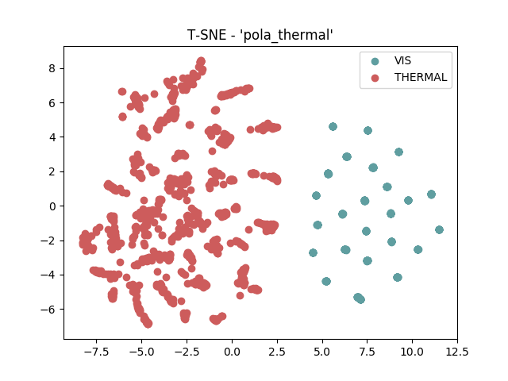
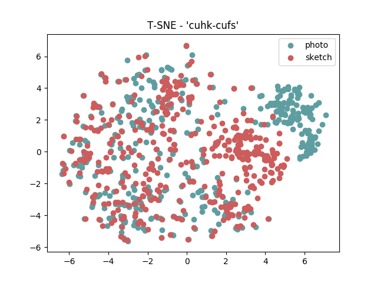
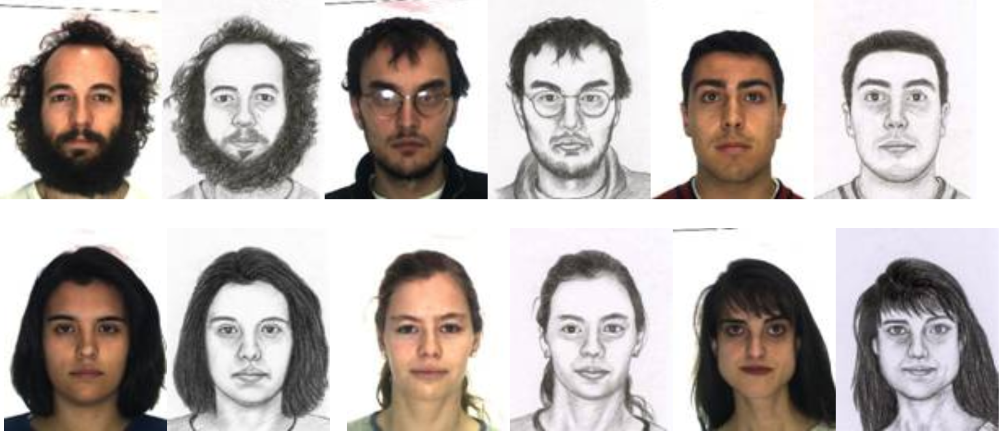

.. vim: set fileencoding=utf-8 :
.. Tiago de Freitas Pereira <tiago.pereira@idiap.ch>

=====================
 Transfer Learning
=====================

In this section we hypothesize that a shared latent subspace exists between two image modalities where the agreement is maximized.
Given a set of covariates of two modalities :math:`x_A` and :math:`x_B`, the goal is to find a common subspace :math:`\phi` where an arbitrary distance function :math:`d` can be applied 
It is expected that the distance is minimal when :math:`x_A` and :math:`x_B` belongs to the same client and maximal otherwise.

First insights
--------------
.. _first-insights:

Before any hypothesis on how to find this :math:`\phi`, we have done two different analysis.
The **first analysis** is exploratory and it consists on the observation of the distribution of the covariates :math:`x_A` and :math:`x_B` for different image modalities.
To support this analysis we use the a well know algorithm that supports the visualization of high dimentional data called `t-SNE <http://scikit-learn.org/stable/modules/generated/sklearn.manifold.TSNE.html>`_.
This algorithm converts similarities between data points to joint probabilities and minimizes the Kullback-Leibler divergence between the joint probabilities of the low-dimensional embedding and the high-dimensional data.
Such exploratory analisys is carried out under two conditions.
The first condition is a direct plot using the pixel space (:math:`x_A` and :math:`x_B`).
For the second condition, such plot is carried out in the embedding space :math:`\phi(x_A)` and :math:`\phi(x_B)`.
The goal of such analysis is to observe if the modalities cluster.

The **second analisys** is more practical and it consists in the analisys of error rates in a closed-set scenario.
The base question here at this point is to know if state-of-the-art face recognition systems can natually handle signals from heterogenous sources.

Such set of tests were conducted under several datasets and they are bellow.

  - `POLA THERMAL`_
  - `CUHK-CUFS`_
  - `CUHK-CUFSF`_
  - `CASIA VIS-NIR`_
  - `NIVL`_
  - More database coming soon

The Resnet v2 architecture (our initial :math:`\phi`)
-----------------------------------------------------

The literature covering deep neural networks is imense; although I will need to cover that at some point, at this stage I will just point to a nice survey where
important engineering decisions, taken along years of research, are described [Canziani2016]_.
Such set of engineering decisions are the basis of the state-of-the-art architectures of today for face recognition.
For this work, we will take one of the state-of-the-art architectures for face recognition Inception-Resnet-V2 [Szegedy2017]_.
Such CNN was trained by ourselves with gray scaled visible light images only using Casia Webface database.
More details about our face recognition baselines and benchmarks can be found `here <http://beatubulatest.lab.idiap.ch/private/docs/bob/bob.bio.face_ongoing/master/index.html>`_.

For the rest of this section, we use :math:`\phi` as a placeholder term for this architecture, whose simple schematic can be seen below.

.. image:: ../img/resnet_v2.png
 :scale: 100 %

.. Todo:: Develop a better plot with tikz

POLA THERMAL
============

Follow below the covariate scatter plot produced with t-SNE, between visible light (:math:`x_A`) and polarimetric thermograms (:math:`x_B`) in the pixel space for the :ref:`pola thermal <db-polathermal>` database.
Such scatter plot is split according to the image modalities.

.. image:: ../plots/transfer-learning/pola_thermal/tsne/pixel_space.png

It's possible to clearly observe a two clusters formed by the image modalities.

Let's observe now the same scatter plot in the embedding space (:math:`\phi(x_A)` and :math:`\phi(x_B)`).

It's possible to clearly observe the same trend as before.
Follow bellow the source code that generate this plot::

  $ ./doc/plots/transfer-learning/pola_thermal/tsne/plot_tsne_resnet_gray.sh

Follow bellow the results in terms of Rank-1 recognition rate

 +------------+--------------+--------+-------------------+
 | Image size | ML           | Feat.  | Rank-1            |
 +============+==============+========+===================+
 | 160 x 160  | Resnet-Gray  |        | 11.798% (1.556)   |
 +------------+--------------+--------+-------------------+

By observing these low error rates along the splits, we can conclude that
using a :math:`\phi` that doesn't take into account the modality prior is not very promissing.

CUHK-CUFS
=========

Follow below the covariate scatter plot produced with t-SNE, between visible light (:math:`x_A`) and viewd sketches (:math:`x_B`) in the pixel space for the :ref:`CUHK-CUFS <db-CUHK-CUFS>` database.
Such scatter plot is split according to the image modalities.

.. image:: ../plots/transfer-learning/cuhk_cufs/tsne/pixel_space.png

It's possible to clear observe two clusters formed by the image modalities.

Let's observe now the same scatter plot in the embedding space (:math:`\phi(x_A)` and :math:`\phi(x_B)`).

Such clusters can't be clearly seen for this pair of modalities.
On possible reason for that is that, with respect to shape, the pairs photos-sketeches from this dataset are quite reliable as we can observe in the figure below.
Even details like the expression, proportion of the face and volume of the hair are the same.
We could suggest that a linear model could be carried out between :math:`x_A` and :math:`x_B`.

Follow bellow the results in terms of Rank-1 recognition rate:

 +------------+--------------+--------+-------------------+
 | Image size | ML           | Feat.  | Rank-1            |
 +============+==============+========+===================+
 | 160 x 160  | Resnet-Gray  |        | 64.158% (3.424)   |
 +------------+--------------+--------+-------------------+

We can observe a recognition rate of ~64%, which is not very low considering that such modality was not observed by the CNN.
However, state of the art algorithms that do consider the joint modeling of the modalities achive recognition rates above 95% for this dataset.

.. +------------+--------------+-------+-------------+
.. | Image size | ML           | Feat. | Rank-1      |
.. +============+==============+=======+=============+
.. | 80 x 64    | ISV (512g)   | DCT   | 94.95(1.57) |
.. +------------+--------------+-------+-------------+
.. | 224 x 224  | Cosine       | VGG16 | 70.49(1.99) |
.. +------------+--------------+-------+-------------+
.. | 224 x 224  | PLDA         | VGG16 | --.--(-.--) |
.. +------------+--------------+-------+-------------+
.. | 128 x 128  | GFK          | Gabor | --.--(-.--) |
.. +------------+--------------+-------+-------------+
.. | 160 x 160  | Cosine       | Resnet| 54.35(1.86) |
.. +------------+--------------+-------+-------------+
.. | 160 x 160  | PLDA         | Resnet| 71.78(1.10) |
.. +------------+--------------+-------+-------------+

CUHK-CUFSF
==========

Follow below the covariate scatter plot produced with t-SNE, between visible light (:math:`x_A`) and viewed sketches (:math:`x_B`) in the pixel space for the :ref:`CUHK-CUFSF <db-CUHK-CUFSF>` database.
Such scatter plot is split according to the image modalities.

.. image:: ../plots/transfer-learning/cuhk_cufsf/tsne/pixel_space.png

It's possible to clear observe a two clusters formed by the image modalities.

Let's observe now the same scatter plot in the embedding space (:math:`\phi(x_A)` and :math:`\phi(x_B)`).

.. image:: ../plots/transfer-learning/cuhk_cufsf/tsne/resnet_gray.png

It's possible to clearly observe the same trend as before.
Follow bellow the source code that generate this plot::

  $ ./doc/plots/transfer-learning/cuhk_cufsf/tsne/plot_tsne_resnet_gray.sh

Follow bellow the results in terms of Rank-1 recognition rate

 +------------+--------------+--------+-------------------+
 | Image size | ML           | Feat.  | Rank-1            |
 +============+==============+========+===================+
 | 160 x 160  | Resnet-Gray  |        | 16.518%(1.394)    |
 +------------+--------------+--------+-------------------+

By observing these lower error rates along the splits, we can conclude that
using a :math:`\phi` that doesn't take into account the modality prior is not very promissing.

CASIA VIS-NIR
=============

Follow below the covariate scatter plot produced with t-SNE, between visible light (:math:`x_A`) and polarimetric thermograms (:math:`x_B`) in the pixel space.
Such scatter plot is split according to the image modalities.

.. image:: ../plots/transfer-learning/casia_nir_vis/tsne/pixel_space.png

It's possible to clear observe a two clusters formed by the image modalities.
Let's observe now the same scatter plot in the embedding space (:math:`\phi(x_A)` and :math:`\phi(x_B)`).

.. image:: ../plots/transfer-learning/casia_nir_vis/tsne/resnet_gray.png

Two clusters are not evident after :math:`\phi(x_A)` and :math:`\phi(x_B)`.
This can suggest that the CNN is able to model this particular pair of input signals and no joint modeling is necessary.
Let's check that in our closed-set evaluation using the rank one recognition rate as a reference.

 +------------+--------------+--------+-------------------+
 | Image size | ML           | Feat.  | Rank-1            |
 +============+==============+========+===================+
 | 160 x 160  | Resnet-Gray  |        | 44.031%(0.999)    |
 +------------+--------------+--------+-------------------+

We can observe a recognition rate that is far from being random, but still far from the state of the art results that do consider joint modeling.

.. +------------+--------------+-------+-------------+
.. | Image size | ML           | Feat. | Rank-1      |
.. +============+==============+=======+=============+
.. | 80 x 64    | ISV (1024g)  | DCT   | 72.38(1.35) |
.. +------------+--------------+-------+-------------+
.. | 224 x 224  | Cosine       | VGG16 | 67.73(1.55) |
.. +------------+--------------+-------+-------------+
.. | 224 x 224  | PLDA         | VGG16 | --.--(-.--) |
.. +------------+--------------+-------+-------------+
.. | 224 x 224  | GFK          | Gabor | 50.93(1.39) |
.. +------------+--------------+-------+-------------+
.. | 160 x 160  | Cosine       | resnet| 34.86(1.18) |
.. +------------+--------------+-------+-------------+
.. | 160 x 160  | PLDA         | resnet| 34.86(1.18) |
.. +------------+--------------+-------+-------------+

NIVL
====

Follow below the covariate scatter plot produced with t-SNE, between visible light (:math:`x_A`) and polarimetric thermograms (:math:`x_B`) in the pixel space.
Such scatter plot is split according to the image modalities.

It's possible to clear observe a two clusters formed by the image modalities.
Let's observe now the same scatter plot in the embedding space (:math:`\phi(x_A)` and :math:`\phi(x_B)`).

.. image:: ../plots/transfer-learning/nivl/tsne/resnet_gray.png

The same trend observed by `CASIA VIS-NIR`_ can be observed here, two clusters are not evident after :math:`\phi(x_A)` and :math:`\phi(x_B)`.
Let's check that in our closed-set evaluation using the rank one recognition rate as a reference.

 +------------+--------------+--------+-------------------+
 | Image size | ML           | Feat.  | Rank-1            |
 +============+==============+========+===================+
 | 160 x 160  | Resnet-Gray  |        | 60.009%(2.518)    |
 +------------+--------------+--------+-------------------+

We can observe a recognition rate that is far from being random, but still far from the state of the art results that do consider joint modeling.

Final Discussion
================

In this first insigh we evaluated one of the state of art neural network architectures under several Heterogenous Face Recognition Databases in a closed set scenario.
Follow bellow a wrap up of the first insights of this study.

 1. For datasets that represent the pairs VIS-sketeches and VIS-thermal the modalities cluster in both pixels space and under our :math:`\phi`. 
 2. For datasets that represent the pairs VIS-NIR the clusters are evident only in the pixels space. Under :math:`\phi`, we could not visually observe such trend. 
 3. For all datasets, using only our :math:`\phi` (that does not jointly model the modalities), we were not able to achieve high recognition rates.

In the light of these points we can conclude that it's wise to consider the target modality as a prior to model :math:`\phi`.

The next subsections we present strategies on how to create a joint model :math:`\phi` between pairs image modalities using two types of architectural setups: siamese and triplet networks.

Siamese and triplet Networks
----------------------------

.. toctree::
   :maxdepth: 2

   siamese_triplet

